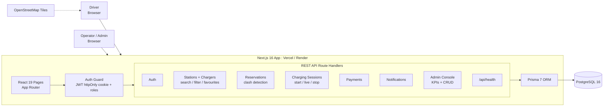
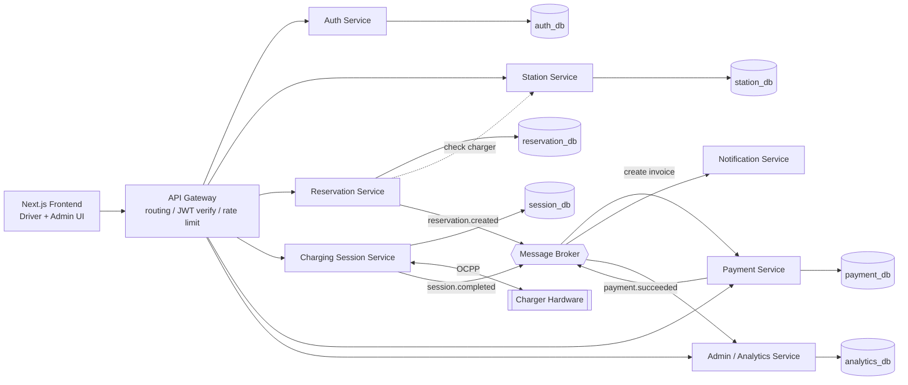
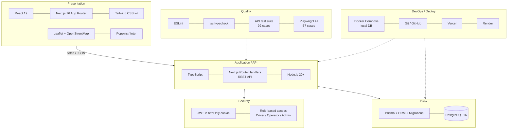

# Volt Grid — System Diagrams

## 1. Current Architecture (Next.js Full-stack Monolith)

ระบบปัจจุบันเป็น Next.js แอปเดียว ทั้งหน้าเว็บและ REST API (Route Handlers) อยู่ในโปรเจคเดียวกัน ใช้ Prisma ต่อ PostgreSQL ตัวเดียว

## 2. Target Microservices Architecture

แผนแยกแต่ละ domain ออกเป็น service อิสระ แต่ละตัวมี database ของตัวเอง สื่อสารผ่าน API Gateway และ event ผ่าน Message Broker

## 3. Technology Stack

